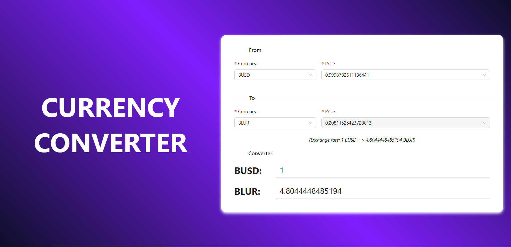
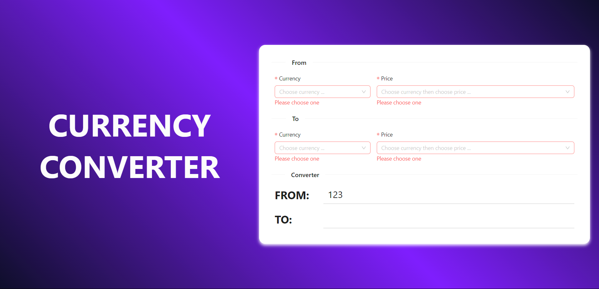

"yarn" to install
"yarn start" to start an app

What do I use?
  - Create React App
  - Ant Design
  - Framer Motion
  - SCSS

My form

Validation

Additionally, I perform some automation actions. Please start the app to experience