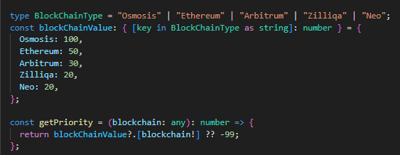
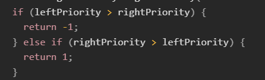

----------------------------------------------------------------------
THE ISSUES AND IMPROVEMENT
--------1--------
Instead of using switch cases, I use the blockChainValue object to map from the blockchain type to a value.

From:

To:

Using the way as in the above code can be considered more optimal than using switch cases in many cases. Here are some reasons why:
  - Read and maintain easier
  - Better performance
  - Easier expansion
  - Reusability

--------2--------
The blockchain attribute has not been declared but is still used, which will cause a program error

--------3--------
Excessive and unnecessary use of if conditions

From:

To:

--------4--------
In sort method, a compare function determines the order of the elements. The function is called with the following arguments:
  - a is the first element for comparison. 
  - b is the second element for comparison. 
It will return a number where :
  - A negative value indicates that a should come before b.
  - A positive value indicates that a should come after b.
  - Zero or NaN indicates that a and b are considered equal.

So we can rewrite the code 
from 

to

That makes the code easier to read, maintain and without if conditions in this code.

--------5--------
Variable sortedBalances and formattedBalances should be declared with the data type

--------6--------
Variable rows return WallerRow component. This component have formattedAmount prop, which take a value of balance.formatted. "formatted" is a property of the FormattedWalletBalance interface, not of the WalletBalance interface. Therefore, we will use formattedBalances to map instead of sortedBalances.

From:

To:

----------------------------------------------------------------------
A REFACTORED VERSION OF THE CODE

interface WalletBalance {
  currency: string;
  amount: number;
  blockchain: string;
}
interface FormattedWalletBalance {
  currency: string;
  amount: number;
  formatted: string;
  blockchain: string;
}

interface Props extends BoxProps {}
const WalletPage: React.FC<Props> = (props: Props) => {
  const { children, ...rest } = props;
  const balances = useWalletBalances();
  const prices = usePrices();

  type BlockChainType = "Osmosis" | "Ethereum" | "Arbitrum" | "Zilliqa" | "Neo";
  const blockChainValue: { [key in BlockChainType as string]: number } = {
    Osmosis: 100,
    Ethereum: 50,
    Arbitrum: 30,
    Zilliqa: 20,
    Neo: 20,
  };

  const getPriority = (blockchain: any): number => {
    return blockChainValue?.[blockchain!] ?? -99;
  };

  const sortedBalances: WalletBalance[] = useMemo(() => {
    return balances
      .filter(
        (balance: WalletBalance) =>
          getPriority(balance.blockchain) > -99 && balance.amount > 0
      )
      .sort((lhs: WalletBalance, rhs: WalletBalance) => {
        const leftPriority = getPriority(lhs.blockchain);
        const rightPriority = getPriority(rhs.blockchain);
        return rightPriority - leftPriority;
      });
  }, [balances, prices]);

  const formattedBalances: FormattedWalletBalance[] = sortedBalances.map(
    (balance: WalletBalance) => {
      return {
        ...balance,
        formatted: balance.amount.toFixed(),
      };
    }
  );

  const rows = formattedBalances.map(
    (balance: FormattedWalletBalance, index: number) => {
      const usdValue = prices[balance.currency] * balance.amount;
      return (
        <WalletRow
          className={classes.row}
          key={index}
          amount={balance.amount}
          usdValue={usdValue}
          formattedAmount={balance.formatted}
        />
      );
    }
  );

  return 
{rows}
;
};
